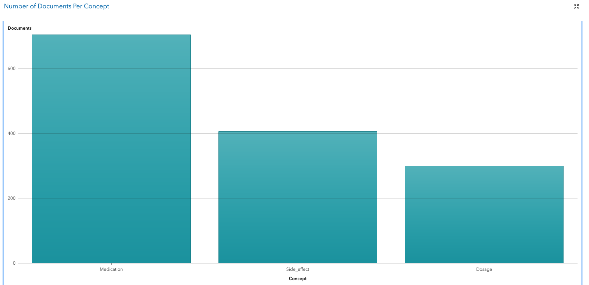

# text_analysis_drug_test_report
Python based analysis of drug test feedback document got from SAS

The DrugTest report dataset which was originally found in SAS can be achieved from following url : 

[DrugDest.zip Dataset (Save this file and uncompress it) ](https://github.com/dmollaaliod/itec874-2019/raw/master/assignments/DrugDest.zip)

# Following task were achieved by the repo

## Task 1 (2 marks) - How many documents mention a medication, or a dosage, or a side effect?

Plot a bar chart that shows the number of documents that contain a medication, the number of documents that contain a dosage, and the number of documents that contain a side effect. Your plot should look like this one.

## Task 2 (3 marks) - How many documents mention each medication?

Display the counts of number of documents that mention each of the following medications:

1. Abidal
2. Cenerol
3. Ecstapin
4. Fortifex
5. Prexifan 

Choose the appropriate chart or charts to display this information so that it is easy to compare the numbers of documents for each medication.

## Task 3 (5 marks) - Which medications are associated with sleep issues?

Identify the medications that are associated with sleep issues. 

## Task 4 (5 marks) - What are the most common concerns expressed?

To complete this task, you need to determine the main concerns expressed in the posts.
## Task 5 (5 marks) - Provide useful additional information.
